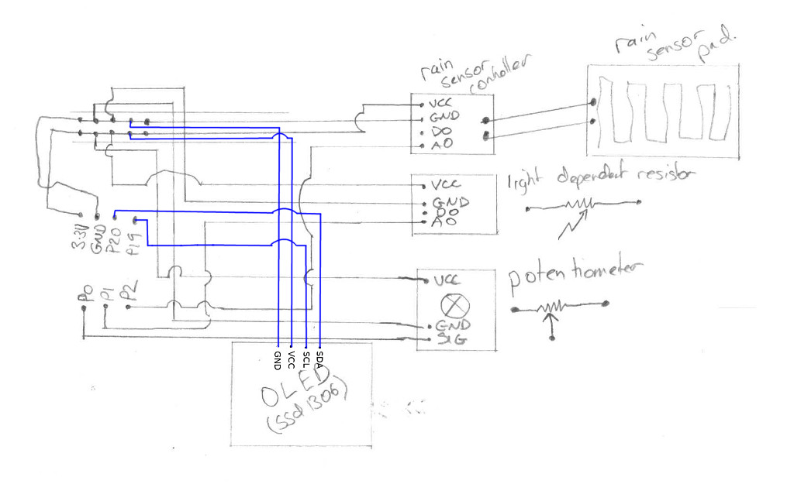

## An Adjustable rain sensor

Uses components from the [Little Bird Electronics 2018 micro:bit Advent Kit](https://www.littlebird.com.au/little-bird-micro-bit-advent-kit-2018) to make an adjustable rain sensor that also knows when it is dark.

### Parts
 - micro:bit
 - breakout board
 - breadboard
 - potentiometer (5 Dec)
 - OLED (6 Dec)
 - Rain sensor (9 Dec)
 - Light dependent resisitor module (12 Dec)

### Wiring
Here is a wiring diagram.  If it is not clear, please get in touch and I will improve it.

### Dependencies
You will need the OLED driver from [https://github.com/fizban99/microbit_ssd1306](https://github.com/fizban99/microbit_ssd1306).  Download it, unzip it and copythe *ssd1306* and *ssd1306_text* files across to your micro:bit [using the Mu editor](https://codewith.mu/en/howto/copy_files_microbit).

### Coding
After copying the dependancies onto you micro:bit, open the python code up in Mu and flash it to your micro:bit.
